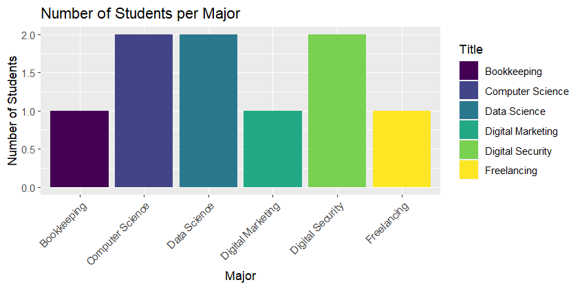
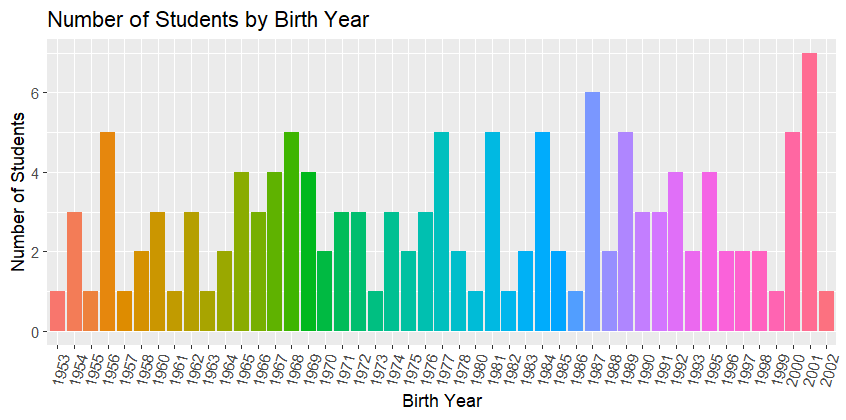
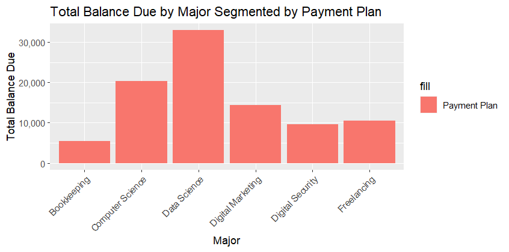
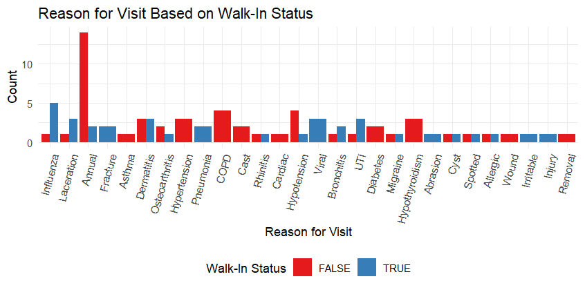
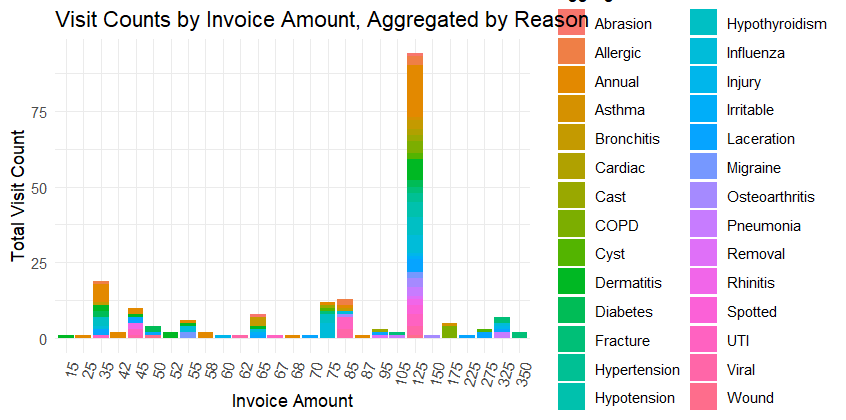
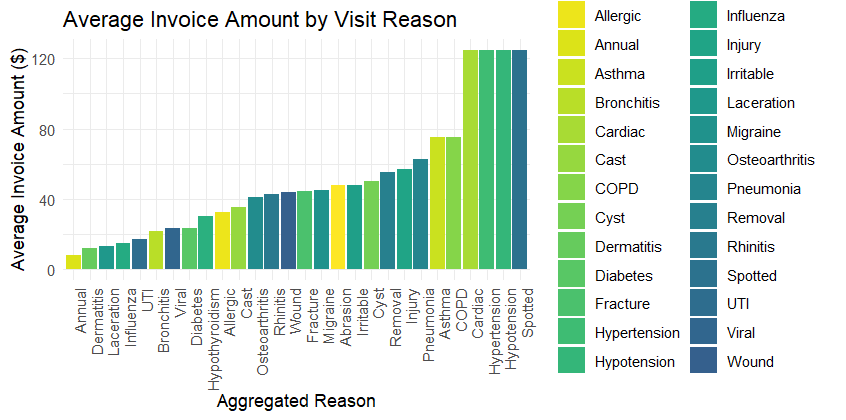

### student-and-patientbilling-assignments

#1.STUDENT README

### number of students per major

In this graph I am plotting the numer of students per major. If we observe, we can see that the science majors ate the ones where there are the most students, as well as in the digital security one. I also used a viridis code for the viridis color palette.

### number of students by birth year

Analyzing this graph about, I can't really say something very specific about it, I just can see that there are slightly more students born in the last years compared to the first years. However, the graph shows a similar data throughout the years. Also the peak is in 2001.

### total cost per major segmented by payment plan

In this graph we can see the cost of each major. The most expensive ones are the science ones -Data and Computer Science- which a significant difference in comparison with the other majors.

### total balance due by major segmented by payment plan

In this last graph, we are getting the total balance due by payment class and is very similar to the previous grapgh as both are related to the money to pay.

#2.PATIENT BILLING README

### proportion of visit reasons by month

### reason for visit based on walk-in status

### visit count by invoice amount, aggregated by reason

### average invoice amount by visit reason

