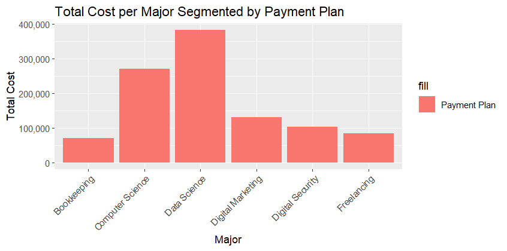

### student-and-patientbilling-assignments

#1.STUDENT README

### number of students per major

In this graph I am plotting the numer of students per major. If we observe, we can see that the science majors ate the ones where there are the most students, as well as in the digital security one. I also used a viridis code for the viridis color palette.

### number of students by birth year

Analyzing this graph about, I can't really say something very specific about it, I just can see that there are slightly more students born in the last years compared to the first years. However, the graph shows a similar data throughout the years. Also the peak is in 2001.

### total cost per major segmented by payment plan

In this graph we can see the cost of each major. The most expensive ones are the science ones -Data and Computer Science- which a significant difference in comparison with the other majors.

### total balance due by major segmented by payment plan

In this last graph, we are getting the total balance due by payment class and is very similar to the previous grapgh as both are related to the money to pay.

#2.PATIENT BILLING README

What I did first is a code to extract only the first word so in that way I could filter some reasons of visit because there were too many. For instance, if there were two reasons that were "hypertension" and other one "hypertension monitoring", then I joined them as "hypertension". 

### proportion of visit reasons by month

I did a stacked bar chart that reflects the proportion of visits depending of the reason why they did that visit. First off, we only got 7 different months from the data, and analyzing it we get that the annual visit is the most common one.

### reason for visit based on walk-in status

We can see something similar to the previous graph with the annual reason dominating over the others. Besides this, we can see some walk-in reasons like influenza or some false walk-in reasons like COPD or hypertension.

### visit count by invoice amount, aggregated by reason

In this graph we can see a clear amount that stands out from others and is the invoice amount of 125.

### average invoice amount by visit reason

In this last graph we have the average invoice amount by visit reaosn where the insights are spotted, hypotension, hypertension, and cardiac reasons are the ones with the highest invoice amount.
